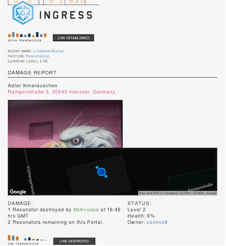
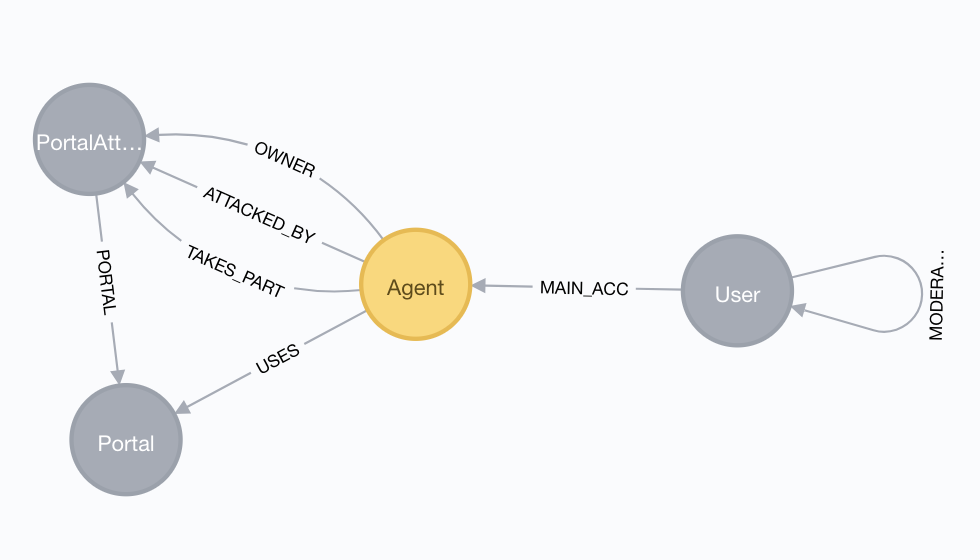
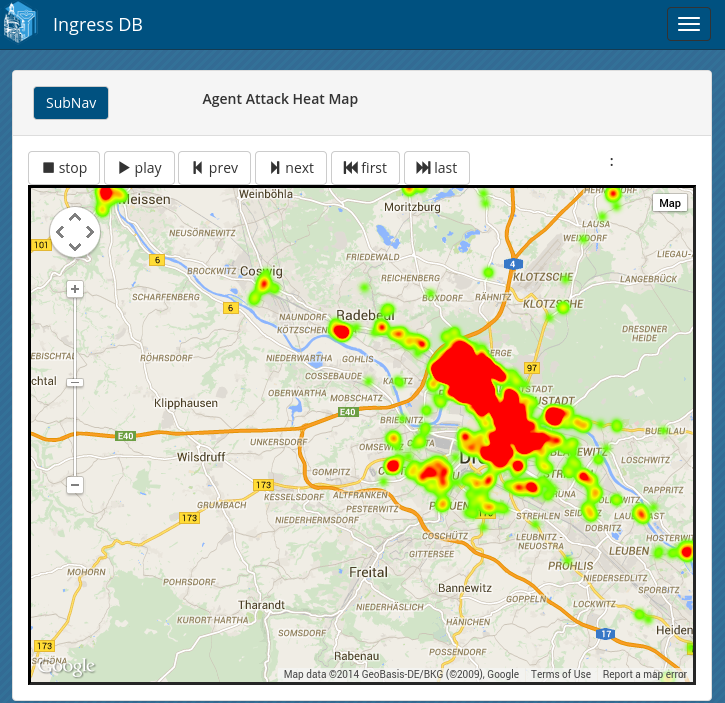
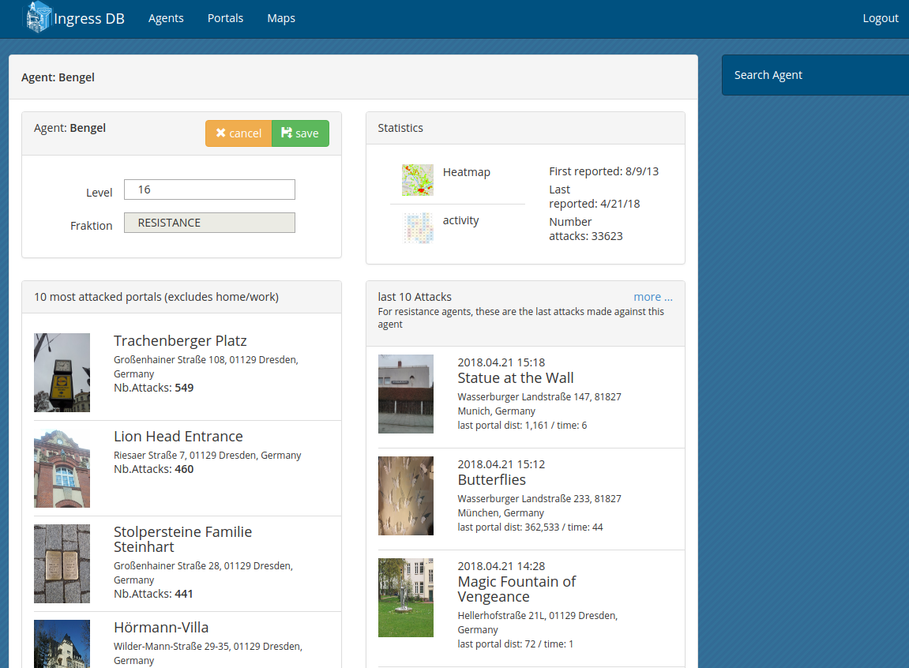
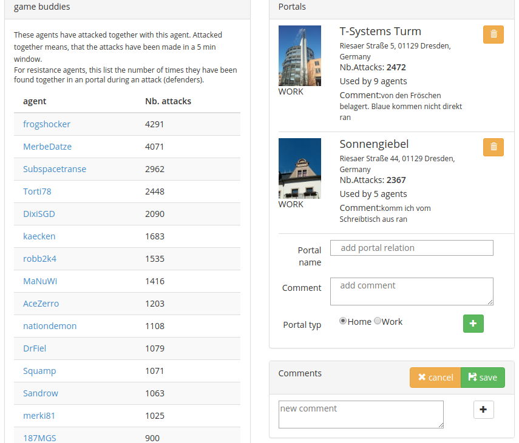

+++
title= "IngressDB: a long-running POC with Neo4j"
slug= "ingressdb-neo4j"
date= 2018-12-03T21:17:55+01:00
lastmod= 2018-12-03T21:17:55+01:00
tags = [ "Neo4j", "Ingress", "Java", "Project"]
layout= "post"
type=  "post"
draft= false
[[resources]]
  name = "header"
  src = "img/header.png"
+++

I like learning new technology. Playing around with it, getting a feel for it. For this, I prefer POCs
that are more substantial than the typical 'hello world' stuff. What would I learn from that?

Some years ago my interest in https://neo4j.com[Neo4j] was awakened by https://twitter.com/mesirii[Michael Hunger]
and https://twitter.com/dirkmahler[Dirk Mahler] (through https://jqassistant.org/[jQAssistant]).

Looking around for something that would allow me to play with Neo4j and be of use for me, I decided to
build a database from available Ingress data.

== Enter Ingress
You may have heard of the AR game PokemonGo. https://ingress.com[Ingress] is similar in that you have to
walk in the real world and visit certain places. Those places are called portals and are player
generated POIs. Players, called agents, belong to one of the 2 factions Enlightened (green) or Resistance (blue) and
fight over those portals. Portals can be linked building triangular fields, scoring points for the owning faction.
How this could look like can be seen in the image of the map above.
Portals can hold up to 8 resonators and you need at least 8 players to build a portal up to the highest level. These,
and other similar rules, 'forces' players to play together. In fact, the communities that build through this where the
only reason to continue playing for me.

NOTE: Privacy concerns: Location-based games as Ingress allow players deducing the location of other players. Ingress, as
one of the first games of that kind is among the worst, as it displays a log of player actions. Most players play during
commuting, giving away information about their home and work locations. I wish such games would warn new players
prominently before starting. +
IngressDB aggregated that information and made it more accessible. This has always been a concern and led to the
*closing of IngressDB and deletion of the data* in April 2018.

== The data
Whenever a resonator is destroyed, the game sends an email to the player that owned the resonator. This
email contains:

- the name of the portal
- a link to the portal (which includes longitude and latitude -> location)
- time and date
- the attacking player name
- a link to the image of the portal
- name of the player that owned the portal

Of course, all of this in a hard to parse HTML felt like it was designed in 1970. Luckily, the
fabulous https://jsoup.org/[jsoup] library helps to parse just about all that ugly HTML.

An attack email looks like the following and contains the needed data in nested HTML tables:

[#img-email, role="img-responsive"]
.An ingress attack email
[link=img/email.png]

My idea was to gather and parse all those emails and generate https://en.wikipedia.org/wiki/Heat_map[heat maps],
showing player activity on a map.

For this, I needed a way to perform simple spatial queries, e.s. bounding box ('give me everything inside that box')
kind of lookups. Luckily, there existed a spatial plugin for neo4j. Documentation was sparse, but my
use case was simple enough to find out how to use it.

== The model
Coming from a relational background, this is the model I came up with:

[#img-model, role="img-responsive"]
.IngressDB data model

Expecting that attacks are the most frequent entity, I decided to group all attacks on a portal within a
certain time window into one `PortalAttack`. It made the writing logic slightly more complex
but allowed for easy lookups later on for the functionality to lookup 'game buddies': agents often playing
together. +
The `:USES` relation was later used to map home/work portals to agents.

The `User` node represents the player; the actual human. As the ingress communities were/are in love with
google plus communities, these are linked to google ids. Due to privacy concerns, I removed the ability
to freely link agents to users and only allowed registered users to create a link between their agent and user.

The app quickly gained popularity, so I needed a way to track who approved a user, resulting in
the `:MODERATOR` relation on the `User`.

== The result
The web part was written in https://wicket.apache.org/[Apache Wicket], mostly because I know that
framework quite well and did not want to add another technology to learn. I'm not a designer,
nor do I know CSS very well, but https://getbootstrap.com[Bootstrap] makes it easy to build
something usable.
For the heat maps I choose google maps:

[#img-heat-map, role="img-responsive"]
.My activity heat map around Dresden

One could search for agents, view most/recent activity:

[#img-agent-top, role="img-responsive"]
.Agents most interacted and most recently seen portals

Or view the game buddies as well as home/work portals:
[#img-game-buddies, role="img-responsive"]
.Game buddies

Other features allowed to see portals one has interacted with on a map. Or a weekday/time of day
activity table.

In the end, about 1500 users were registered at the service with about 50 - 100 using it on a daily
basis. Through emails parsed, the database did hold:

[cols="2*",options="header",width="80%"]
|===
|Node
|Entries

|Portals
|830.407

|Attacks
|11.879.005

|Agents
|179.272

|User
|1594

|===

[cols=2*,options=header,width="80%"]
|===
|Relation
|Entries

|Portal-Attacks
|11.879.005

|Agent-Attack
|40.652.249

|Agent-Portal
|2835
|===

Not exactly big data, but enough to show me that neo4j can handle data even on sub-par
hardware very well.

== Conclusion
The project started with neo4j 1.9.5 and spring-data-neo4j 2.3.3.RELEASE. At that time, the recommended way to use
neo4j was in the embedded mode. Due to the use of the spatial plugin, I could not always use the newest version of neo4j and
spring-data.
With the new versions came the usage of neo4j in proper server mode, which
allowed me to separate the email parsing and storing component from the web part into two independent running artefacts.

With the newly released version 3.5 of neo4j, my life would have been a lot easier, as this version does now include basic
spatial functions without the need for a plugin. Also, the improved write speed and the added time datatype(s) would have
been very welcomed when I was developing the application.

All in all, developing with neo4j has been a pleasure, I learned a lot along the way. Its been my first NoSQL database
to use and I was feeling uncertain about not having a schema to rely on. But this turned out to be easy. +
Due to a bug, I did have to refactor the data later on and ran into problems with too large transaction for the available
memory. But with https://neo4j-contrib.github.io/neo4j-apoc-procedures/[APOC] and help from Michael, this could be solved as well.

NOTE: People asked for the source code of the IngressDB, but I'm hesitant to show it. It grew out of a POC and I never
found the time to clean up. Just to add new functions. But I created a
 https://gist.github.com/taseroth/f4fccb306a275a4bf04907888305df9e[gist showing the repository layer] with the cypher
 queries. Comments welcome.