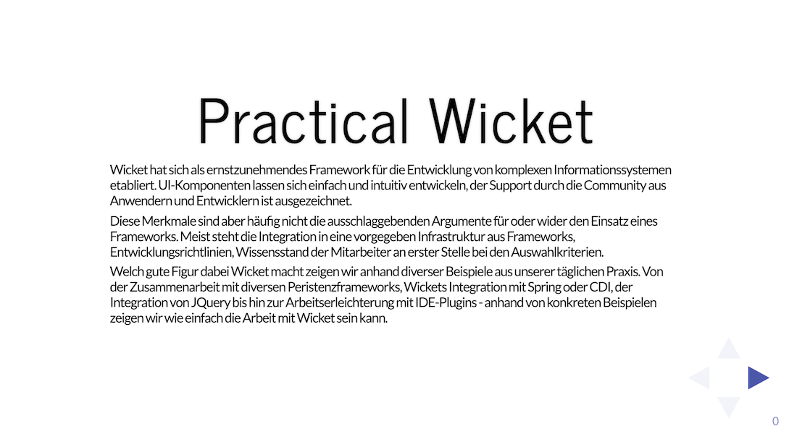

+++
title= "Practical Wicket"
slug= "practical-wicket"
date= 2018-12-21T11:20:07+01:00
lastmod= 2018-12-21T11:20:07+01:00
tags = [ "Talk", "Apache Wicket"]
layout= "post"
type=  "post"
draft= false
+++

Mein erster öffentlicher Talk war auf auf dem https://www.jug-saxony-day.org/2014/[JUG Saxony Day 2014]
zusammen mit https://twitter.com/magomi[Marco]. Nachdem wir beide bereits Erfahrungen im
Einsatz https://wicket.apache.org/[Wicket] sammeln konnten, wollten wir diese weitergeben.

NOTE: This page is in german, since the presentation was given in German and the slides are in German too.

Der Vortrag wurde nicht aufgezeichnet, aber die Folien sind auf https://github.com/magomi/practicalwicket[Github]:

[#img-slides, role="img-responsive"]
[link=https://magomi.github.io/practicalwicket-praesentation/#/]

