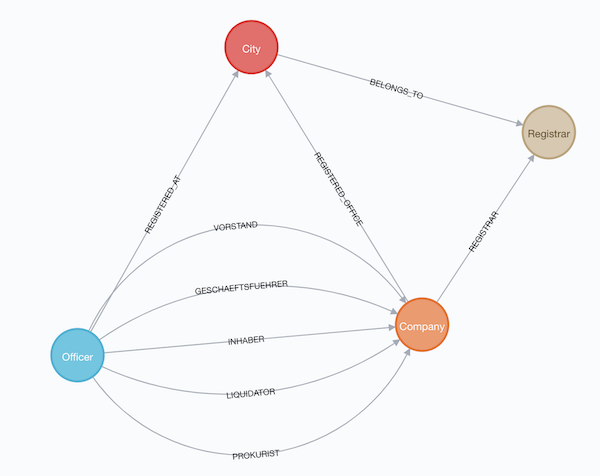
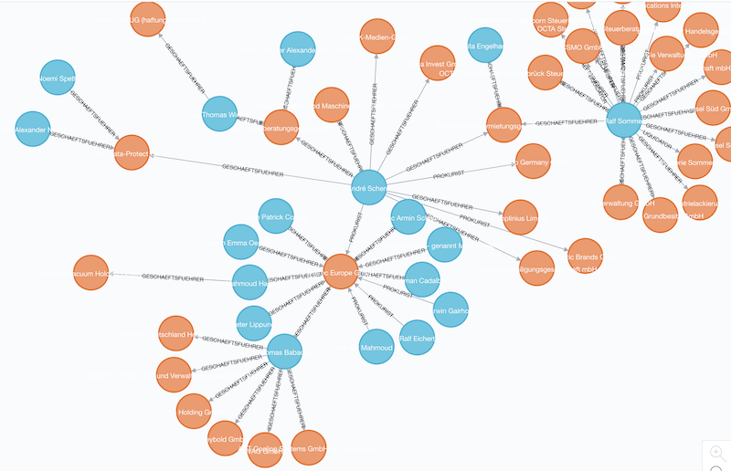

+++
title= "Importing corporate data into neo4j"
slug= "handelregister-neo4j"
date= 2019-02-14T12:07:32+01:00
lastmod= 2019-02-14T12:07:32+01:00
tags = [ "Open Data", "Neo4j"]
layout= "post"
type=  "post"
[[resources]]
  name = "header"
  src = "img/header.jpg"
+++

https://twitter.com/opencorporates[Opencorporates] recently made the German cooperate data
https://blog.opencorporates.com/2019/02/06/german-company-data-now-available-for-download-via-open-knowledge-deutschland/[publicly available].
What better moment to learn how to import data into neo4j?

Utilizing  the https://neo4j-contrib.github.io/neo4j-apoc-procedures/[APOC] extension, one can load the data from
various sources (HTTP, file) in JSON, CSV or XML format.

The corporate data is available in JSONL format, which means that each line in the file is a JSON object.
The lines are not bound together into an array.

After downloading and extracting the data, I had one file of about 4GB. A quick peek revealed the following structure:
[source,json]
----
{
  "all_attributes": {
    "_registerArt": "HRB",
    "_registerNummer": "126167",
    "additional_data": {
      "AD": true,
      "CD": true,
      "DK": true,
      "HD": false,
      "SI": true,
      "UT": true,
      "VÖ": true
    },
    "federal_state": "Hamburg",
    "native_company_number": "Hamburg HRB 126167",
    "registered_office": "Hamburg",
    "registrar": "Hamburg"
  },
  "company_number": "K1101R_HRB126167",
  "current_status": "currently registered",
  "jurisdiction_code": "de",
  "name": "Verseau Industrial Machinery Trading GmbH",
  "officers": [
    {
      "end_date": "2016-07-07",
      "name": "Zahra Abdi Savejiani",
      "other_attributes": {
        "city": "Hamburg",
        "dismissed": true,
        "firstname": "Zahra",
        "lastname": "Abdi Savejiani"
      },
      "position": "Geschäftsführer",
      "type": "person"
    }
  ],
  "registered_address": "Sierichstraße 16, 22301 Hamburg.",
  "retrieved_at": "2017-07-05T21:12:01Z"
}
----
Each line contains all the data for one company as well as all the officers for that company. The role of the
officer is provided via the ```position``` attribute, more on this later. I could not make any sense of the data given
under ```additional_data``` and decided to ignore it. Since I did not know much about the kind of queries
I would run against the data, I first modelled the registrar and cities as their own nodes and came up with the following model:

[#img-model, role="img-responsive"]
.First version of the schema
[link=img/schema.png]


After playing around with the imported data, I decided that the ```City``` and ```Registrar``` nodes do
not add any value for me and removed them as nodes, resulting in a schema that only consists of ```Company``` and ```Officer``` notes.

Since Cypher does not currently allow to have dynamic types of relationships, I needed to know the values
of the ```position``` attributes for an officer:
[source,bash]
----
sed '1s/^/[/; $!s/$/,/; $s/$/]/' de_companies_ocdata.jsonl | jq '.[]? | .officers | .[]? | .position' | sort -u
"Geschäftsführer"
"Inhaber"
"Liquidator"
"Persönlich haftender Gesellschafter"
"Prokurist"
"Vorstand"
----
This is using the ```jq``` JSON tool to parse out the position values. Since jq does not work with JSONL, I formed
one big array using ```sed```.

How much data do we have?
[source,bash]
----
wc -l de_companies_ocdata.jsonl
 5305727 de_companies_ocdata.jsonl
----
About 5.3 million lines aka companies. Throwing all of this at neo4j in one block would require a lot of
memory as the JSON would need to be parsed and converted. Also, the transaction would be rather large, adding to the
needed memory.

I decided to split the data into files, each containing 5000 companies. Also, each file needed to be a valid JSON file,
so I concatenated the lines into an array:
[source,bash]
----
gsplit -a6 -d --additional-suffix=.jsonl -l 5000 de_companies_ocdata.jsonl split/handel

for f in handel*; do sed '1s/^/[/; $!s/$/,/; $s/$/]/' $f > ../json/$f; rm $f; done
----
NOTE: Needed ```gsplit```, as the split on the mac is a missing some of the options needed.

We now have the data in digestible chunks and can start importing. I used ```python -m SimpleHTTPServer```
to serve the files via HTTP. Putting them into the neo4j import folder should have worked as well.

As preparation I adjusted the memory for neo4j so that all the data would fit into it:
[source]
----
dbms.memory.heap.max_size=4G
dbms.memory.pagecache.size=6G
----

Since I used the ```MERGE``` cypher command to prevent data duplication, I learned that it is very helpful
to add indices to the attributes one wants to merge against:
[source]
----
create constraint on (n:Company) assert n.id is unique;
create constraint on (n:Officer) assert n.name is unique;
----

The import script:
[source]
----
call apoc.periodic.iterate( # <1>
"unwind range(0, 1061) as filenb return filenb", # <2>
"call apoc.load.jsonArray('http://localhost:8000/split/json/handel'+substring('000000',size(filenb+'')) + filenb +'.jsonl')
    yield value with apoc.convert.toMap(value) as c # <3>

merge (company:Company {id:c.company_number}) on create set company.name = c.name,
       company.status = c.current_status, company.jurisdictionCode = c.jurisdiction_code,
       company.address = c.registered_address, company.registerArt = c.all_attributes._registerArt,
       company.registerNummer = c.all_attributes._registerNummer,
       company.registerOffice = c.all_attributes.registered_office,
       company.nativeCompanyNumber = c.all_attributes.native_company_number,
       company.previusNames=[p IN c.previous_names | p.company_name],
       company.federalState = c.all_attributes.federal_state, company.registrar = c.all_attributes.registrar

foreach (o in c.officers |
	merge (officer:Officer {name:o.name}) on create set officer.firstName = o.other_attributes.firstname,
      		officer.lastName = o.other_attributes.lastname, officer.registeredOffice = c.all_attributes.registered_office
	foreach(i in case when o.position = 'Geschäftsführer' then [1] else [] end |
    					merge (officer)-[r:GESCHAEFTSFUEHRER]->(company)
                        	on create set r.dismissed=o.other_attributes.dismissed,
                            	r.startDate = date(o.start_date),
                                r.endDate = date(o.end_date))
    foreach(i in case when o.position = 'Persönlich haftender Gesellschafter' then [1] else [] end |
    					merge (officer)-[r:GESCHAEFTSFUEHRER]->(company)
                        	on create set r.dismissed=o.other_attributes.dismissed,
                            	r.startDate = date(o.start_date),
                                r.endDate = date(o.end_date))
    foreach(i in case when o.position = 'Inhaber' then [1] else [] end |
    					merge (officer)-[r:INHABER]->(company)
                        	on create set r.dismissed=o.other_attributes.dismissed,
                            	r.startDate = date(o.start_date),
                                r.endDate = date(o.end_date))
    foreach(i in case when o.position = 'Prokurist' then [1] else [] end |
    					merge (officer)-[r:PROKURIST]->(company)
                        	on create set r.dismissed=o.other_attributes.dismissed,
                            	r.startDate = date(o.start_date),
                                r.endDate = date(o.end_date))
    foreach(i in case when o.position = 'Vorstand' then [1] else [] end |
    					merge (officer)-[r:VORSTAND]->(company)
                        	on create set r.dismissed=o.other_attributes.dismissed,
                            	r.startDate = date(o.start_date),
                                r.endDate = date(o.end_date))
    foreach(i in case when o.position = 'Liquidator' then [1] else [] end |
    					merge (officer)-[r:LIQUIDATOR]->(company)
                        	on create set r.dismissed=o.other_attributes.dismissed,
                            	r.startDate = date(o.start_date),
                                r.endDate = date(o.end_date))
)", {batchSize:1, parallel:false})
----
<1> ```apoc.periodic.iterate``` accepts 2 cypher queries, iterating as long as the first query produces values
and providing the output of the first as additional parameters for the second query. After each iteration, a commit is performed.
<2> this just produces all the values between 0 and 1061 (the number of created via split above)
<3> construct the URL to load the JSON and parse it into a map

The ```foreach``` around the relation merges is a hack since relation types cannot be dynamic.

The import of the 4GB data took on my MBP about 10 minutes. Not toobad.

With the data in place, one can now start exploring. The image right at the top shows the companies of some
far-right Germans.

Searching for a company called "Schulenberg & Schenk" I came up with the mesh of companies below. They are a law firm
that I received a letter from a few years back, claiming some copyright infringement. They are 'famous'
in Germany for sending out adhortatory letters on behalf of the pornographic industry. I did win that lawsuit.

[#img-schulenberg, role="img-responsive"]
.Schulenberg & Schenk
[link=img/schulenberg.png]


It would be cool to enrich that graph with data from other sources. I was looking for data about german
politicians, but could not find any. If you know any public available sources, please ping me
via https://twitter.com/taseroth[Twitter]

