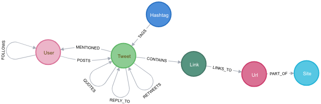
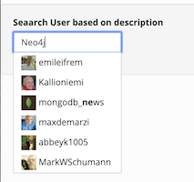

+++
title= "Seachbox"
slug= "seachbox"
description = "implementing a google-like searchbox"
date= 2020-01-07T20:52:43Z
lastmod= 2020-01-07T20:52:43Z
tags = [ "Neo4j", "Indexing", "Algorithms"]
layout= "post"
type=  "post"
draft= false

+++

A customer asked me recently how to implement a google-like search box. Users should be able to insert a search  string and get a meaningful auto-complete back. The text to search for was coming from a single label / property. Meaningful in the context meant that:

 * results that start with the search string should come first
 * results that contain the search string should come after the first group
 * relevant results should come first in each group
 * the search should cope with spelling errors

Neo4j indexes have improved significantly with the 3.5 release, and we have all we need available. With an index on the property, a `STARTS WITH` is fast enough for our purpose. For the 2 criteria, we could use a `CONTAINS` operator. But, this is not super fast. Both operators do not support 'sounds like' (spelling error) searches. Ignoring that fact for a moment, how can we achieve the ordering of the results? A simple `UNION` to combine to searches works well: (pseudo code:)
[source]
----
match (n) where n.property STARTS WITH $searchterm return n.property as result order by result limit 5
UNION
match (n) where n.property contains $searchterm return n.property as result order by result limit 5
----

But, as mentioned, the second part of the query is not _that_ fast and so far we only have exact search.

Luckily, Neo4j supports https://neo4j.com/docs/cypher-manual/3.5/schema/index/#schema-index-fulltext-search[full-text search], backed ny Apache Lucene. Lucene provides performant contains searches as well as _fuzzy_ search. Disadvantage: they are not integrated into Cypher, instead one has to work with the `db.index.fulltext.*` group of procedures. Searching for a search term brings back the matched node and score, indicating how relevant Lucene thinks the result is. Unfortunately, I could not find a way to combine a `starts with` search with fuzziness in Lucene.

To demo the idea, I used data I https://github.com/taseroth/twitter-crawler[parsed from Twitter] for the Neo4j filter bubble. The model ist simple and for our search we only need the `User` Node and the `FOLLOWS` relationship:
[#img-model, role="img-responsive"]
.Twitter schema
[link=img/schema.png]

There are currently about 4 million user nodes and the database is roughly 50GB in total. Big enough to prove the search works.

I created a Lucene index via:
[source]
----
call db.index.fulltext.createNodeIndex('desc', ['User'], ['description'])
----
NOTE: Lucene indexes can span multiple Labels and properties.

How would our search using that index look like?
[source]
----
match (u:User) where u.description starts with 'data'
   return u.name as user, u.description as description order by description limit 5
UNION
CALL db.index.fulltext.queryNodes('desc', 'data~') YIELD node, score with node as user, score
  return user.name as user, user.description as description order by score desc limit 5
----

The first part uses a Neo4j index to find anything starting with `data` and the second part is doing the fuzzy `contains` search.

The result:
[cols="2,5",options=header,format=csv]
|===
user,description
Edvard,data
skyler,data & design @ spotify https://t.co/JGRCbJR8cb
Seth Goldman,data & insights at @DiscoveryEd | @mcps & @UofMaryland alum | #rstats & #PyData acolyte
Mariella de Crouy Chanel,data & interactive graphics • #d3js #python #dataviz • #luxembourg • ☀️
Alberto Gonzalez Paje,data + design @fjord
The MarcLab for Connectomics,In the data.
All the Mais Christian,Data are.
Brice Richardson,Data | Data | Data. Father of 2.
Daya Insan Sidhmukh,daya
|===

So far so good, but what about the relevance criteria? Well, since we are using a graph database, this is easy. Neo4j provides a https://neo4j.com/docs/graph-algorithms/current/[Graph Algorithms] library which allows us to easily calculate a score (relevance) of a node. In this example, I choose the page rank algorithm, using the followers relationships:
[source]
----
CALL algo.pageRank('User', 'FOLLOWS',
  {iterations:20, dampingFactor:0.85, write: true,writeProperty:"pagerank"})
YIELD nodes, iterations, loadMillis, computeMillis, writeMillis, dampingFactor, write, writeProperty
----
This calculates a ranking of users and writes the result back as `pagerank` property on the `User` label.

To use that pagerank, the query now looks like this:
[source]
----
match (u:User) where u.description starts with 'data'
  return u.name as user, u.description as description, u.pagerank as rank order by u.pagerank desc limit 5
UNION
CALL db.index.fulltext.queryNodes('desc', 'data~') YIELD node, score with node as user
 return user.name as user, user.description as description, user.pagerank as rank order by rank desc limit 5
----
Whis gives a much better result:
[cols="2,5,2",options=header,format=csv]
|===
user,description,rank
sanor,"data analyze & visualize product planner, maybe... interested in web analytics, ML, AI & energy harvesting",69.05611869508866
fred datchary,dataviz for competitive intelligence prospective & innovation,1.3347132024937312
Marko Plahuta,"data visualization & machine learning, owner of https://t.co/KZ7W1Fay1B",0.9176865824265407
Doyle Groves,"data scientist, independent variable",0.8436535432512754
Algorithmic,data || :@mecanosaurio,0.8076913597062231
Neo4j,The #1 platform for connected data. Developers start here: https://t.co/ZNvqS5dNkT,85.15298753585668
Dew Wardah,"I like data, web, semantic web| Random tweets,suka suka ;)|was born on Oct 26th|Indonesian|Moslem|Javanese",79.48458906039595
GraphGrid,"Graph Cloud at global scale, secured and trusted by Enterprise and Government to deliver ROI through Connected Data",77.12317710816859
privaGRAPH,"No more a '(personal #data protection and #information architect). I'm a #graph lover, a casual #Rstats/#Lisp/#Smalltalk/#Prolog dev and a #kickscooter addict",71.80954438261689
Aleksander Stensby,"COO at monokkel.io. Software developer, architect and data geek.",69.947878979519
|===

As you can see, Neo4j has the highest relevance in my dataset, but as the description does not start with `data` is comes as number 5.

There are many UI components for a google-like search available, I choose http://easyautocomplete.com/[easyautocomple] as it only needed jQuery as dependency and comes with good documentation.
Even without much configuration, it can use images in the list:
[#img-autocomplete, role="img-responsive"]
.Autocomplete example

The data is provided via a REST endpoint which in turn calls above query. With Spring Boot, this is just a few lines of code. You can check my example on https://github.com/taseroth/searchbox[Github]