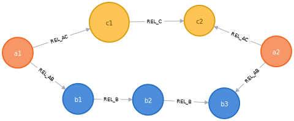

+++
title= "Schema-based access control in Neo4j 4.0"
slug= "schema-access-control"
description = "Neo4j 4.0 introduced schema based access control. Lets explore it."
date= 2020-01-29T10:59:47+01:00
lastmod= 2020-01-29T10:59:47+01:00
tags = [ "Neo4j", "Neo4j-4.0"]
layout= "post"
type=  "post"
draft= false
[[resources]]
  name = "feature"
  src = "img/header.png"
+++

Neo4j had https://neo4j.com/docs/operations-manual/3.5/authentication-authorization/native-user-role-management/native-roles/[role-based access control] for some time now.
But this did not provide the fine-grained control some business need. Even if they only need it to put a checkmark on a security audit and perform the actual restriction in the application logic.

As https://twitter.com/jimwebber[Jim Webber] https://youtu.be/AfhJcyys108?t=2612[pointed out so nicely], security is not the hottest topic for most (me included) developers. But, due to how you typically query graph databases, we need something more advanced and more fun.

NOTE: If you want to follow along, I suggest using 2 different sessions (esp. Neo4j Desktop browser and a separate session in a browser) to avoid constantly switching users. I will use a prompt in the code snippets to show which database/user is in use.

Before we start, lets create a database and a user with a role:
[source]
----
system$ CREATE OR REPLACE DATABASE blog;
system$ create or replace user user_a set password 'blog' set password change not required;
system$ create or replace role role_a as copy of reader;
system$ grant role role_a to user_a;
----
The new user will have the `role_a` which in turn is based on the build-in `reader` role. And yes, finding good names is hard.

As user with write permissions (neo4j) we create some data to work with:
[source]
----
:use blog

blog$ match(n) detach delete n;

blog$ create (a1:A {name:'a1'})
  create (a2:A {name:'a2'})
  create (b1:B {name:'b1', propB:'b'})
  create (b2:B {name:'b2'})
  create (b3:B {name:'b3'})
  create (c1:C:D {name:'c1', propA:'a', propB:'b'})
  create (c2:C {name:'c2'})
  create (a1)-[:REL_AB {propAB: 'ab'}]->(b1)
  create (a1)-[:REL_AC {propC: 'c'}]->(c1)
  create (b1)-[:REL_B]->(b2)
  create (b2)-[:REL_B]->(b3)
  create (a2)-[:REL_AB]->(b3)
  create (a2)-[:REL_AC]->(c2)
  create (c1)-[:REL_C {propC:'c'}]->(c2);
blog$ match (d:D) set d.propD = 'D'
----
This gives us the following graph:

[#img-graph, role="img-responsive"]
.example graph

Note that `c1` has the labels `C` and `D`.  As you can see:
[source]
----
match (c1:C {name: 'c1'}) return c1, labels(c1) as labels
╒═════════════════════════════════════════════════╤═════════╕
│"c1"                                             │"labels" │
╞═════════════════════════════════════════════════╪═════════╡
│{"propB":"b","name":"c1","propA":"a","propD":"D"}│["C","D"]│
└─────────────────────────────────────────────────┴─────────┘
----
Querying by label `D` would return the same result, as expected. When we deny read access to a property for a role:
[source]
----
system$ deny read {propD} on graph blog nodes D to role_a
----
Then that property will not be included in the return:
[source]
----
blog$ match (d:D) return d
╒═════════════════════════════════════╕
│"d"                                  │
╞═════════════════════════════════════╡
│{"propB":"b","name":"c1","propA":"a"}│
└─────────────────────────────────────┘
----
Again matching on `C` would return the same set of properties; the properties belong to a node, not to a specific label of that node. Something to keep in mind.
In the same way, access to all properties of a label, or a specific property across all labels can granted or denied. Access can either be read or write. A detailed description can be found in the https://neo4j.com/docs/cypher-manual/4.0/administration/security/subgraph/[cypher manual].

The fun starts with traversing the graph. With the new access restriction features, one can allow or deny to traverse over nodes and relationships, without reading any data from them. This includes the type or labels associated.

If we want to find the shortest path between `a1` and `a2` in our example graph above:
[source]
----
blog$ match p=shortestPath((:A {name: 'a2'})-[*]-(:A {name:'a1'})) return p
----

we get a path traversing the the `C` nodes:
[#img-shortest-path, role="img-responsive"]
.shortest path

or in ASCII art:
[source]
----
[{"name":"a2"},{},{"name":"c2"},{"name":"c2"},{"propC":"c"},{"propB":"b","name":"c1","propA":"a","propD":"D"},{"propB":"b","name":"c1","propA":"a","propD":"D"},{"propC":"c"},{"name":"a1"}]
----

If we now deny access to the `C` nodes:
[source]
----
system$ deny read {*} on graph blog nodes C to role_a;
// or
system$ deny traverse on graph blog nodes C to role_a;
----
then we can't traverse over the `C` nodes and the shortest path becomes:
[#img-restricted-path, role="img-responsive"]
.shortest path with restrictions

or in ASCII:
[source]
----
╒══════════════════════════════════════════════════════════════════════════════════════════════════════════════════════════════════════════════════════════════════╕
│"p"                                                                                                                                                               │
╞══════════════════════════════════════════════════════════════════════════════════════════════════════════════════════════════════════════════════════════════════╡
│[{"name":"a2"},{},{"name":"b3"},{"name":"b3"},{},{"name":"b2"},{"name":"b2"},{},{"propB":"b","name":"b1"},{"propB":"b","name":"b1"},{"propAB":"ab"},{"name":"a1"}]│
└──────────────────────────────────────────────────────────────────────────────────────────────────────────────────────────────────────────────────────────────────┘
----
Traversal restriction also works based on relationship types.

The following picture from the https://neo4j.com/docs/cypher-manual/4.0/administration/security/subgraph/[cypher manual] gives a good overview of the syntax:
[#img-grant-syntax, role="img-responsive"]
.grant syntax

The link above also contains descriptions of how to revoke grants again.

