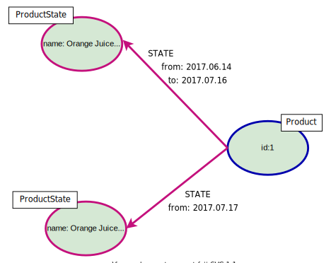
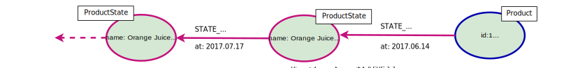
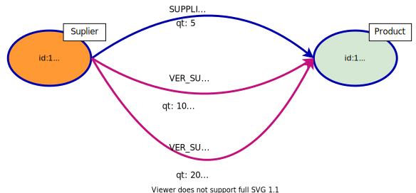

+++
title= "Versioned Graph Models"
slug= "versioned-model"
description = "Exploring options for versioning data changes in a graph"
date= 2020-03-03T08:28:49+01:00
lastmod= 2020-03-03T08:28:49+01:00
tags = [ "Neo4j", "Modelling"]
layout= "post"
type=  "post"
draft= false
[[resources]]
  name = "feature"
  src = "img/header.jpg"
+++

One recurring question I hear is how to version graph data. Versioning here means to keep track of changes made to the graph. These changes could be:

 * modifying properties on nodes or relationships (add, remove change properties)
 * structural changes (add or removal of nodes and relationships)

Ian Robinson wrote a https://web.archive.org/web/20180530094235/http://iansrobinson.com/category/neo4j/[blog post] about the topic back in 2014. Unfortunately, his blog is deleted and only available via the internet archive. Many of the ideas here are derived from his post. If you prefer watching videos, there is a great https://www.youtube.com/watch?v=Cm1yd8d7qv0&list=PL9Hl4pk2FsvUbsmdPrqTRF_DWvUb4z5AK[talk] from the Nodes 2019 online conference by https://twitter.com/ElLazal[Lju Lazarevic] on that subject. There is also a https://medium.com/neo4j/keeping-track-of-graph-changes-using-temporal-versioning-3b0f854536fa[textual version of that talk], where Lju is also investigating bi-temporal versioning.

There are many different reasons to track changes to the graph and the selected strategy has the fit that needs. Esp, if you want to keep an audit log of changes, the solution will most likely differ from the options discussed here.

Depending on the volatility of your data, keeping old versions might increase the size of the graph significantly. In graph modelling, you usually structure your model for optimized querying. If you are mostly interested in the current state of the graph and only seldom access the history, you will want to structure the versioning in a way that the current state is easy to access.

## State changes

The general idea proposed by Ian is to separate structure (identity) from state. The following picture shows a single Product node with 2 versions:
[#img-identity-state, role="img-responsive"]
.separating structure (identity) from state

NOTE: I use colour-coding in the examples. Blue indicates identity nodes/relationships, and red indicates state (change) relationships/nodes.

Here, all information about the Product is moved to the ProductState nodes. For every change to the Product, a new ProductState node is created. The current state can be found by following the un-terminated STATE relationship (the one without a 'to' property). Depending on the change frequency on the Product node, this can be an expensive operation, as one would have to filter all STATE relationships to find the current state of the Product.

If you need the current state most of the time, keeping the state in the node itself (in our case, the Product) simplifies access. The next picture describes such a model.
[#img-linked-list, role="img-responsive"]
.keeping current state in node and history in linked list

Reading the state and history becomes easier in this model, but at the price of more logic when changing data. In this example, I also used a linked list for the history of changes. With this, we only need to store the time of the change in the relationship. Listing the history becomes a simple traversal from the Product node.

## Structural changes

### Relationships
Tracking changes to the structure of a graph means tracking changes to the relationships in the graph. For this, we can add `from` and `to` temporal attributes to the relationships. A missing `to` attribute would indicate the current relationship. If no relationship without `to` exists then we have no path from the source node to the target node in the current graph.

Depending on the queries you ask your graph and the frequency at with the relationships change, this might not be practical. A solution would be to have 'versioned' relationships with `from` and `to` attributes and your 'normal' relationships as you would have them in an un-versioned graph. See the next picture for an example:
[#img-versioned-realtionships, role="img-responsive"]
.versioning relationships

In this example, changes to the `qt` attribute lead to a new version of the relationship. Changing the type of relationships leads to expressive and faster queries, but requires more effort when writing. APOCs https://neo4j.com/docs/labs/apoc/current/graph-updates/graph-refactoring/set-relationship-type/[apoc.refactor.rename.type()] can help with rewriting the relationship.

### Node deletions
To track deletions of nodes and keep their history, we have to implement some sort of 'soft deletions', e.g. mark them as deleted, but keep them in the graph. Every relationship touching the node needs to be marked as not valid any more (see above). With this, traversals should not reach the node. For the node itself, we have the following options:

 * add a *boolean flag* 'deleted' and a deletion time to the node. This implies, that every query has to be changed to take the flag into account. Missing this, we might include the node into the result for a query asking for the current state of the graph. On the other hand, this option is easy to implement.
 * add a *marker Label* 'Deleted'. Basically the same as above, with a slightly different query syntax.
 * *rename the Label* and add a deletion time attribute to the node. This is more complex at the deletion time, but we do not need to change any queries that only look at the current state of the graph.

NOTE: Changing the type and labels of the nodes/relationships also allows us to restrict access to these nodes using https://neo4j.com/docs/operations-manual/current/authentication-authorization/access-control/[schema based access control] introduced in Neo4j 4.0

## Change detection

To keep track of changes in the graph, we need to detect changes. This could be done in application code, but this is error-prone and easy to forget. Another approach is to use Neo4j versions of triggers. These are plugins written in Java and registered with the Neo4j instance at startup. The Neo4j API allows registering https://neo4j.com/docs/java-reference/current/transaction-management/events/[transaction event listeners]. As the name implies, these are part of a transaction and have access to all data changes in the transaction.
