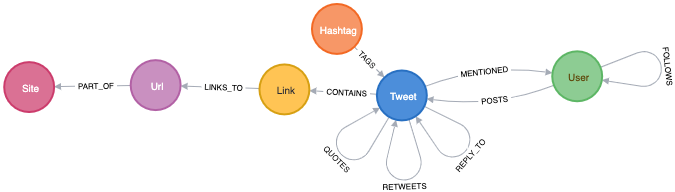
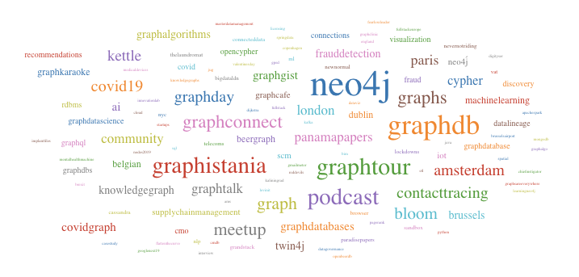

+++
title= "Exploring Twitter data with Vuejs and GRANDstack"
slug= "vuejs-grandstack-cognito"
description = "Building a Vue.js application atop of Grandstack with user authentification agains AWS Cognito"
date= 2020-09-20T17:40:52+02:00
lastmod= 2020-09-20T17:40:52+02:00
tags = [ "GraphQL", "Vue.js", "GRANDstack", "Cognito"]
layout= "post"
type=  "post"
[[resources]]
  name = "feature"
  src = "img/header.png"
+++

In this post, I'm going to look into building a Vue based SPA application, that loads data via graphQL from a Neo4j database. I will describe how to set up the API via GRANDstack, access it from Vue, and secure it via JWT provided from AWS Cognito.

I also used this to teach myself Vue (and to some extend JavaScript) so bear with me if some of the things I do are not 'the JavaScript' way to do it.

You can explore the demo application on https://github.com/taseroth/twitter-gvandstack[Github]

To have some meaningful data, I used my https://github.com/taseroth/twitter-crawler[TwitterScrapper] to fill the database. The schema should be self-explanatory for anyone knowing a bit about Twitter. If you want to follow along, you can grab the scrapper and run it yourself. You only need to register with Twitter for API access.

[#img-schema, role="img-responsive"]
.Twitter graph schema
[link=img/schema.png]

Twitter is always a good data source, it is nicely 'graphy' and one can use the data to produce nice pics like the one at the top of this page, which shows parts of my Twitter bubble.

In the end, we would have the following components:

* Neo4j database
* graphQL API listening for HTTP requests and translating between graphQL and Cypher. For now, only read access is provided, not mutations.
* a SPA (in this case build with Vuejs), sending graphQL queries to the API
* AWS Cognito to provide JWTs which will be used in the SPA and API to secure access to resources

Let's get started.

https://grandstack.io/[GRANDstack] provides (besides good documentation) a great way to scaffold a project by simply calling:
[source]
----
npx create-grandstack-app <your-project>
cd <your-project>
----
It will ask a few questions and create the following for us:

* the API module in the `api` subdirectory
* the React web component in `web-react` , since we are going to use Vue.ja, feel free to delete this directory
* a `docker-compose.yml` and accompanying `Dockerfile` 's in the relevant subdirectories
* `.env` files to configure the modules
* the `scripts` subdirectory contains code to seed a database generate the graphQL schema from a Neo4j database

We will start with

== The API

is responsible for answering graphQL queries with data from a Neo4j database. It leverages the Apollo server and extends the functionality with the help of the `neo4j-graphql-js` package with resolvers to translate graphQL queries into Cypher queries. The necessary plumbing is already done during the scaffolding process, we will later adjust the configuration in the `src/index.js` file.

Since we are starting with a pre-filled database we will not need the seeding capabilities and can remove them:

[source]
----
api>rmdir -rf src/seed
api>npm uninstall --save @apollo/client csv-parse react
----
Also, note that there is `src/initialize.js` that will be executed at start-up and can be used to create indexes in the database. Check the content, so it does not infer with your schema.

=== GraphQL schema
The most important part of the API is the graphQL schema definition. GRANDstack comes with a script that can inspect a Neo4j database and write that schema file for you:
[source]
----
>npm run inferschema:write
----
This will create the file `api/src/schema.graphl`. It serves as a good starting point to define the shape of our API. The User type will look something like this:
[source]
-----
type User {
   _id: Long! <1>
   createdAt: LocalDateTime <2>
   description: String
   followersCount: Int
   friendsCount: Int
   id: Int! <3>
   isProtected: Boolean
   lastScanned: LocalDateTime <2>
   location: String
   name: String
   profileImageURL: String
   screenName: String!
   tweetCount: Int
   verified: Boolean
   posts: [Tweet] @relation(name: "POSTS", direction: "OUT") <4>
   follows: [User] @relation(name: "FOLLOWS", direction: "OUT") <4>
   tweets: [Tweet] @relation(name: "MENTIONED", direction: "IN") <5>
}
-----
<1> the Neo4j internal node id, you should normally avoid using these (they will be re-used after deletions)
<2> `LocalDateTime` is not part of the graphQL spec types, but an addition to work with the Neo4j Date and Time types. We will see later how these get expanded at query time
<3> In the Neo4j schema, this is an Integer and is filled with IDs coming from the Twitter API. As these can get very large, Twitter recommends to use strings, but the Twitter4J library I use for scrapping is still using `long`. Unfortunately, graphQL can't handle numbers of that size. I had to change that line to `id: String!`. Something to watch out for in your schemas.
<4> The `@relationship()` annotation allows defining relations between types/nodes, allowing `neo4j-graphql-js` to traverse the graph if a graphQL query requests one the annotated attributes. Can be used to request data from linked types as deep as needed
<5> To give it more semantic meaning, we will rename this to `mentions`.

We can also add new attributes to a type that get calculated by adding a Cypher query. Say, we want to have a list of the 10 most used Hashtags of a given user. We can achieve this via:
[source]
----
top10Hashtags: [String] @cypher(statement: """
   match p=((this)-[:POSTS]->(:Tweet)<-[*1..2]-(h:Hashtag))
     with h.name as hastag, count(p) as cnt order by cnt desc limit 10
   return collect(hastag)
   """)
----
Whenever queried, top10Hashtags will contain a list max 10 hashtags, ordered by usage count. The query will only be executed if that attribute is requested by a query. Also, note that each graphQL query is answered by just one cypher query.

Running the API, we can start querying it. Tools like *GraphiQL* help in writing queries by examining the provided schema and expanding attributes as need.

NOTE: Running the API via `npm run start:dev` prints the generated Cypher query to the console. Helpful in understanding how the graphQL query gets translated. You may also notice that all graphQL queries, no matter how deeply nested, are translated into a single Cypher query. `neo4j-graphQL-js` uses the https://neo4j.com/labs/apoc/[APOC] plugin for more complex queries, which must be present on the Neo4j server.

Querying for the User Neo4j:

[source]
----
{
  GetUser(first:10, filter: {screenName: "neo4j"}) {
    name
    screenName
    description
    createdAt { <1>
      year
      month
      day
      hour
      minute
      second
      millisecond
      microsecond
      nanosecond
      formatted
    }
    top10Hashtags
    profileImageURL
  }
}
----
<1> LocalDateTime is an object, we can specify what attributes we want to see at query time.

The result may look something like this (shortened for brevity):
[source]
----
{
  "data": {
    "GetUser": [
      {
        "name": "Neo4j",
        "screenName": "neo4j",
        "description": "The #1 platform for connected data. Developers <snip>>",
        "createdAt": {
          "year": 2009,
          "month": 3,
          "day": 2,
          "hour": 9,
          "minute": 59,
          "second": 15,
          "millisecond": 0,
          "microsecond": 0,
          "nanosecond": 0,
          "formatted": "2009-03-02T09:59:15"
        },
        "top10Hashtags": [
          "neo4j",
          "graphdatabase",
          "connecteddata",
          "graphdatabases",
          "twin4j",
          "graphconnect",
          "graphdatascience",
          "datascience",
          "cypher",
          "covid19"
        ],
        "profileImageURL": "https://pbs.twimg.com/profile_image..<snip>..i.jpg"
      }
    ]
  }
}
----

Let's assume we want to add a Tag Cloud to our application, for this we would not only need the Hashtags, but also the count of their references in Tweets. We can do this by defining an additional type and fill it with a cypher query, returning a map projection with the attributes from the type:

[source]
----
type User {
  <snip>
   tagCounts: [TagCount] @cypher(statement: """
   match p=((this)-[:POSTS]->(:Tweet)<-[*1..2]-(h:Hashtag))
     with h.name as hashtag, count(p) as cnt order by cnt desc where cnt > 1
   return {text: hashtag, value: cnt}
   """)
}

type TagCount {
   text: String!
   value: Int!
}
----

Now we can query it:
[source]
----
{
  GetUser(filter: {screenName: "rvanbruggen"}) {
   name
   tagCounts (first:3) { <1>
    text
    value
  }
  }
}
----
And get something like this in the response:
[source]
----

{
  "data": {
    "GetUser": [
      {
        "name": "Rik Van Bruggen",
        "tagCounts": [
          {
            "text": "neo4j",
            "value": 560
          },
          {
            "text": "graphdb",
            "value": 142
          },
          {
            "text": "graphtour",
            "value": 64
          }
        ]
      }
    ]
  }
}
----
<1> You can use `first` and `offset` for pagination.

Using some JavaScript library we can turn this data in beautiful Tag-Clouds in our UI:
[#img-rik, role="img-responsive"]
.Rik van Bruggens tag cloud
[link=img/rick-tags.png]

=== Adding authentication / authorization

We want our graphQL endpoint to be secured, so only authorized users can access it. GRANDstack authentication via supports https://jwt.io#debugger-io[JSON Web Token] out of the box. The JWT must be provided in an HTTP header `authorization: Bearer <token>`. A token usually contains information about the user such as name, email, id and groups. We can leverage that information to restrict access to graphQL objects via annotations in the schema. The annotations can be placed on:

 * types
 * attributes
 * queries
 * mutations

and restrict access to these. If a query tries to access such a secured resource, an error is returned (graphQL does not use HTTP response codes).

With the following query definitions, we require all queries to be authenticated and restrict access to the User information to authenticated users:
[source]
----
type Query {
   GetUser: [User] @isAuthenticated
   GetHashtag: [Hashtag]
}
----
Let's assume the location of a User should be restricted to members of `group1`:
[source]
----
type User {
   location: String @hasRole(roles:[group1])
   <snip>
}
enum Role { <1>
   group1
   group2
   group3
}
----
<1> The groups used in the `hasGroup` annotation need to be declared in the schema.

We also need to configure the graphQL server to accept these annotations and parse the HTTP header for the JWT. In `api/src/index.js` the following changes need to be made:
[source, javascript]
----
import {
  IsAuthenticatedDirective,
  HasRoleDirective
} from 'graphql-auth-directives' <1>

const schema = makeAugmentedSchema({
  typeDefs,
  config: {
    query: true,
    mutation: false, <2>
    auth: {
      hasRole: true, <3>
      isAuthenticated: true, <4>
    }
  },
})

const server = new ApolloServer({
  context: ({ req }) => {
    return {
      driver, neo4jDatabase: process.env.NEO4J_DATABASE, req <5>
    }
  },
  ...<snip>
})

----
<1> include the needed directives
<2> disabling mutations, as this api is read-only
<3> enable the role directive
<4> enable the authentication directive
<5> inform the ApolloServer to include the req in the context, so that the directives have access to the authorization header.

The `hasGroup` directive assumes that the group information is stored under the `roles` name in the JWT payload. For AWS Cognito, this is not the case, and we have to provide the key via an environment variables by adding `AUTH_DIRECTIVES_ROLE_KEY=cognito:groups` to the `api/.env` file.

All access to the graphQL queries now need to provide the authorization header.

== Vue
GRANDstack comes with a preconfigured React application. My particular requirement included building the frontend in https://vuejs.org[Vue].

NOTE: Just after I finished my demo application, https://github.com/vuejs/vue-next/releases/tag/v3.0.0[Vuejs 3.0 One Piece] was announced. The code I show is still based on version 2.

I found the https://www.vuemastery.com[Vue Mastery] video/courses extremely helpful for learning. And as I used the demo to learn Vue, I used some concept that might not be needed for something that simple, esp. Vuex for state management (which a separate module for anything related to twitter data) and Vue router for mounting parts of the application on different URLs. The code for interacting with the graphQL endpoint lives in its own service file. I like to separate concerns and modularise applications.

Vue comes with its own cli, which helps to scaffold the application via: `vue create web-vue` and answering a few questions.

Calling the graphQL API is done through the Apollo client library, which of version 3 can be used without loading all of React into the application:

[source, javascript]
----
import {
  ApolloClient,
  InMemoryCache,
  HttpLink,
  ApolloLink,
  gql,
} from '@apollo/client/core'
----

The below code configures the client to use the JWT from local storage and pass it along to the graphQL calls:
[source, javascript]
----
const httpLink = new HttpLink({ uri: graphQlUrl })
const authLink = new ApolloLink((operation, forward) => {
  const user = JSON.parse(localStorage.getItem('user')) <1>
  const token = user ? user.jwtToken : null
  operation.setContext({
    headers: {
      authorization: token ? `Bearer ${token}` : '',  <2>
    },
  })
  return forward(operation)
})
const client = new ApolloClient({
  link: authLink.concat(httpLink),
  cache: new InMemoryCache({
    addTypename: false,  <3>
  }),
})
----
<1> reading the token from local storage
<2> setting the correct authorization header if a token is present
<3> this is enabled by default and leads to added `__typename` fields which currently don't work with `neo4j-graphql-js` `LocalDateTime` extension, so we need to disable it

The token is obtained from AWS Cognito via amplify.

== AWS Cognito

AWS claims that Cognito (User-Pools) is 'simple'. If so, I don't want to use anything they deem as complex. To be fair, Cognito is probably more than just an auth provider and integrates into the vast AWS stack. If all you need is an authorization provider that supports JWT, go for something simpler (https://auth0.com[Auth0]).

[#img-cognito-claim, role="img-responsive"]
.The promise of AWS Cognito
[link=img/aws-cognito-claim.png]
image::img/aws-cognito-claim.png[The promise of AWS Cognito]

Using AWS feels like a time warp back by 20 years when I had to click around Oracles application server consoles. The guides on AWS are mostly click-guides but don't tell you what you much in terms of concept. For security-related services, this feels dangerous. Ok, rant over.

For Cognito, you don't have to click that much, but download the amplify cli, answer a few questions and drink coffee waiting for the cli to finish doing whatever it is doing there.
I found https://dev.to/dabit3/the-complete-guide-to-user-authentication-with-the-amplify-framework-2inh[The Complete Guide to User Authentication with the Amplify Framework] helpful, but in the end, all you have a bunch of files in you project folder without knowing what they do, what the keys in there doing and which of them you can securely to put into version control. Sorry ranting again.

There is https://docs.amplify.aws/lib/auth/start/q/platform/js#configure-your-application[some documentation] which hints that one either create the user pool manually or by the above amplify cli and just store the listed properties for `Amplify.configure({..})` call in `.env` files.

The needed dependencies can be added to the Vue project via `npm install -save amazon-cognito-identity-js`.

NOTE: Adding the amplify dependencies to our Vue app will increase the JavaScript to be loaded by the browser by over *6MB*. I used operation systems smaller than that. Sorry, ranting again. But for basically just sending a few HTTP requests, amplify seems *slightly* over-complicated. It probably provides way more functionality, but I could not find a slimmed-down version providing just that.

The sample application does not provide user-sign-on, so I created a user manually in the Cognito console, also created a `group1` group and added the user to it, so we can see if the group check on the graphQL API works as expected.

Users created in Cognito start in a state that requires them to change their password, which is good practice for a production system, but represented me with the problem on how to activate the user. The amplify documentation did not provide information on the flow of API calls to use, so I ended up temporarily adding the amplify-vue component just to change the password once.
Again: Cognito and amplify are probably great if you want to secure access to all your AWS services. But it comes with a significant learning investment that is not justified if all you need is a simple JWT token.

Once amplify / Cognito / user-pool is configured, using the API is surprisingly simple and convenient:
[source, javascript]
----
import Amplify, { Auth } from 'aws-amplify'
import awsconfig from '@/aws-exports'

Amplify.configure(awsconfig)

export default {
  login(username, password) {
    return Auth.signIn(username, password)
  },
  logout() {
    return Auth.signOut()
  },
}
----
Both, `signIn()` and `signOut()` return promises, which makes using them in modern web frameworks easy.

== Round-up
Coming from a Java and REST background, I did have some reservations about graphQL, but the flexibility it offers to the client and the ease of use provided by GRANDstack did surprise me.
One could probably go even a step further and use the React-graphQL or Vue-graphQL components, but I'm not yet ready to put (data)-queries into UI components.

Building the demo application was fun, you can check out the code at https://github.com/taseroth/twitter-gvandstack[Github]. I might even add more features in the future.
