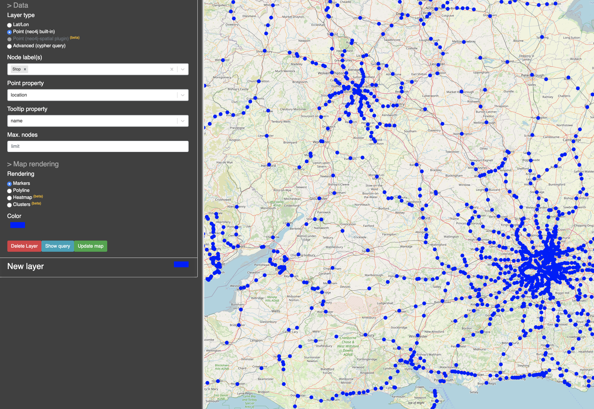

+++
title= "Loading the UK GTFS data feed"
slug= "loading-uk-gtfs"
description = "loading the UK GTFS data feed into Neo4j and explore the data we have and start  journey finding with Cypher"
date= 2021-01-03T14:10:44+01:00
lastmod= 2020-12-19T14:10:44+01:00
tags = [ "Neo4j", "Cypher", "GTFS"]
layout= "post"
type=  "post"
[[resources]]
  name = "feature"
  src = "img/header.png"
+++

Recently I got involved with a customer that had build a journey/route finding for public transport systems. This topic has been high on my list to experiment with so I will use the Xmas break to play with some data.

I wanted to use the German http://bahn.de[Deutsche Bahn] as an example, as I use them quite frequently and therefore have a good understanding of what a 'good' route would look like. Unfortunately, http://bahn.de[Deutsche Bahn] does not provide usable data.

NOTE: Bit of a rant: The Deutsche Bahn opened https://developer.deutschebahn.com/store/[an API], but it is close to useless, as one would have to build a crawler that glues all the bits and pieces the API provides together. Besides, it is rate limited. For my use case, I only need data for the train schedule. The Deutsche Bahn must have the data available, as it provides a https://developers.google.com/transit/gtfs[GTFS] feed, but only for Google. There is a https://github.com/patrickbr/db-api-to-gtfs[project on Github] that tries do solve that, but I could not get it to work. Then there is https://gtfs.de[GTFS.de] that claims to provide data, but the free tier is rather limited.

After spending way to much time trying to get schedule data for the German train systems, I gave up and just used the https://github.com/planarnetwork/feeds.planar.network[UK data].

https://developers.google.com/transit/gtfs[GTFS]  is the semi-standard developed by Google and many transport companies provide their data in this format. There is also the https://github.com/public-transport/friendly-public-transport-format/blob/master/spec/readme.md[friendly public transport format] which I found a good read and I recommend to read https://github.com/public-transport/falsehoods[falsehoods programmer believe].

Now pathfinding in public transport is such a natural fit for a graph database that of course colleagues of mine have written about it before.

https://twitter.com/rvanbruggen[Rik Van Bruggen] blogged http://blog.bruggen.com/2015/11/loading-general-transport-feed-spec.html[back in 2015] about loading GTFS data into Neo4j. I will mostly follow Rik's examples, updated to reflect the current state of Neo4j's Cypher syntax.

https://twitter.com/adamcowley[Adam Cowley] blogged https://neo4j.com/blog/journey-planning-why-i-love-cypher/[about Journey Planning] and derives a graph model. I may come back and borrow bits from there, but as I'm not planning to use pure Cypher I will stay close to Rik (and therefore the GTFS) model.

Google provides some https://developers.google.com/transit/gtfs[documentation] for GTFS, in the end, it is a set of *.txt files zipped together. These *.txt files are actually CSV files, which allows us to import them with the `LOAD CSV` command from Neo4j's Cypher.

The basic building blocks are:

* *agency.txt*: describes the companies running trains/busses/.. contained in the set
* *stops.txt*: information about places where trains/busses/.. stop and allow for embarking. Contains data such as Name, geo-location and others. Stops might build a hierarchy (but not in the UK data set used here)
* *stop_times.txt*: contains arrival and departure times for trips at a stop along with some other optional information
* *trips.txt*: the above stop_times use a trip_id, these are defined in here and bound to route_id and service_id
* *routes.txt*: bind one or more trips together and provides additional information, such as the agency and naming
* *calendar.txt*: provides information on which weekdays the services from the trips.txt are running
* *transfer.txt*: minimum required time to change train/bus/... at a stop.

There are more (optional) files and data points that can be contained in a GTFS feed (esp. fares information), but the UK set does not contain it and for our little experiment we are not needing them.
There is nothing explicit in the GTFS data about recurring services, say a train that is running every hour from A to B. Each of them will be an additional set of entries in the *stop_times.txt* file. For a busy subway service that runs every 5 minutes, this will lead to a lot of `STOPS_AT` relationships. This might impact performance and we might remodel this later on.

The resulting schema in the database will represent this:
[#img-schema, role="img-responsive"]
.GTFS graph schema

I created some https://github.com/taseroth/gtfs-routing/blob/main/src/main/resources/schema.cypher[constraints] to ensure uniqueness and created indexes on the properties the import will match/merge against.

The data is simple enough to use a `LOAD CSV` inside a https://github.com/taseroth/gtfs-routing/blob/main/src/main/resources/import.cypher[simple Cypher script]. The script creates all the nodes and relationships while converting data into Neo4j types. It also creates the `NEXT_STOP` relationships between the `StopPoint` nodes in the right order, building the chain of stops of a trip.

The arrival and departure time information on the `StopPoint` is basically a 24h format but allows for hours greater than 23 for trips that carry on over midnight. For now we keep the original string representation and store it as a duration offset. This duration will hold the offset from midnight ('00:00:00') on the day of the trip start.

== Exploring the imported data

The GTFS documentation on routes.txt and service_id is not very clear, so I will try to extract the meaning from the data.

The geo-information on the stops is stored as Neo4j Point type, allowing the usage of https://github.com/stellasia/neomap[NeoMap] inside of Neo4j Desktop to quickly verify the locations of the imported Stops:
[#img-neomap, role="img-responsive"]
.NeoMap displaying stops
[link=img/neomap_small.png]

This will also alert us that there is at least one stop with incorrect latitude/longitude information (at 0/0). Something to be aware of when we are starting to use the location information.

After the import, we have the following nodes and relationships in our database:
[format="csv", options="header"]
|==========================
Type, Count
(:StopTime),"2,751,258"
(:Trip),"210,764"
(:Route),"4,523"
(:Stop),"3,001"
(:Agency),33
[BELONGS_TO],"2,751,258"
[STOPS_AT],"2,751,258"
[NEXT_STOP],"2,540,494"
[USES],"210,764"
[OPERATES],"4,523"
|==========================

To get a feeling of the data distribution, I used the https://github.com/nielsdejong/neodash/blob/master/README.md[NeoDash] App to visually explore some metrics. The configuration/queries I used can be imported from link:neo4dash.json[here]

The first chart shows the distribution of `StopTime` to `Stop`, e.g. how many `Trip` stop at a `Stop`. When we start to include service changes into the routing, this will impact performance as for busy Stops, more possibilities need to be explored.
[#img-stop-stoptime, role="img-responsive"]
.Distribution of STOPS_AT by Stop

As we can see, the vast majority of stops have a limited set of Trips stopping, but there are a few busy stops, as was to be expected.

The following query will list us the 10 most busy stops in our database:
[source]
----
match (s:Stop)<-[r:STOPS_AT]-() return s.name, count(r) as cnt order by cnt desc limit 10
----
[format="csv", options="header"]
|==========================
Stop name, Count
Clapham Junction,26116
London Bridge,20103
London Victoria,13749
London Waterloo,11988
Willesden Junction,11906
New Cross,11672
East Croydon,11087
London Liverpool Street,10739
Bethnal Green,10650
Purley,10420
|==========================

I was wondering about the meaning of the service_id on the trip data and looked at the distribution of service_id to trip:
[#img-service-destibution, role="img-responsive"]
.Distribution of service_id

Again an uneven distribution. To understand the usage of the service_id on our data, let's find the trips that use the same set of `Stop` s:
[source]
----
match (t:Trip)<-[:BELONGS_TO]-()-[:STOPS_AT]->(s)
 with {trip : t.id, stops : collect(s.code)} as trips
 with trips.stops as stops, collect(trips.trip) as trips where size(trips) > 5
 return trips, stops order by size(stops) desc limit 10
----

[format="csv", options="header"]
|==========================
Trips,Stops
"[101394,47890,47911,66164,66656,265831]","[BAGSHOT,CMBLEY,ALDRSHT,ASCOT,FRIMLEY,ASHVALE]"
"[137296,155980,244620,273057,273062,292829]","[WRABNES,MANNGTR,PRKSTON,MISTLEY,HARWICH,DOVRCRT]"
"[6241,154551,176883,176886,176958,203405]","[KENSLG,QPRK,STNBGPK,HARLSDN,WLSD]"
"[6232,6309,136383,154614,154708,271606]","[KENSLG,HARLSDN,WLSD,STNBGPK,QPRK]"
"[6235,43703,43709,154559,154697,176964,203428]","[QPRK,KENSLG,WLSD,HARLSDN,STNBGPK]"
"[6240,43552,154555,176851,203581,228397,271564,271828,284746]","[WLSD,STNBGPK,HARLSDN,KENSLG,QPRK]"
"[3168,19130,19142,168597,168613,168616]","[WISBBUS,PBROSTI,PBRO,PBROKLB,PBRODMP]"
"[1012,1019,45177,246779,258651,156408,178120]","[IPSWICH,WSTRFLD,TRIMLEY,FLXSTOW,DERBYRD]"
"[6226,6228,43587,136411,136438,154581,154613,176872,176887,203394,293545]","[KENSLG,QPRK,WLSD,HARLSDN,STNBGPK]"
"[6216,23869,43748,176882,177006,331173,271603]","[HARLSDN,QPRK,STNBGPK,WLSD,KENSLG]"
|==========================
Looking at the second entry, we can see on MeoMap that this is a short trip on the British east coast:
[#img-sample-trip, role="img-responsive"]
.Sample trip

With the following query:
[source]
----
match (t:Trip)<-[:BELONGS_TO]-(st)
    where t.id in ["137296", "155980", "244620", "273057", "273062", "292829"]
  with t, st.departureTime as time order by t, st.stopSequence asc
return t.id, collect(time) as timing order by timing asc
----
we can see the departure timing for the involved trips:
[format="csv", options="header"]
|==========================
Trip ID, Timing
292829,"[06:10:00,06:14:00,06:19:00,06:27:00,06:30:00,06:32:00]"
273057,"[12:28:00,12:30:00,12:33:00,12:39:00,12:45:00,12:50:00]"
244620,"[13:10:00,13:14:00,13:19:00,13:27:00,13:30:00,13:32:00]"
137296,"[14:53:00,14:55:00,14:58:00,15:04:00,15:10:00,15:15:00]"
273062,"[15:00:00,15:04:00,15:09:00,15:17:00,15:20:00,15:22:00]"
155980,"[22:28:00,22:30:00,22:33:00,22:39:00,22:45:00,22:50:00]"
|==========================
The timings look off, as the time between the first 2 stops is different. Looking at the attached `Route` and the order of the `Stop` s, we see that half of the trips from Manningtree to Harwich Town and the other half return on the same route. Only 2 of these trips share the same service_id.

So in GTFS terms (and hence in our model), the `Route` is what in "Layman's terms" is a service, but only in one direction, while the service_id is only used to bind weekdays to trips.

== Finding routes

To find a journey, we need to match the start and end stop and then traverse along the graph:
[source]
----
match p=(start:Stop)<-[:STOPS_AT]-()-[:NEXT_STOP*]->()-->(dest:Stop)
where start.name = 'Aberdeen' and dest.name = 'Penzance'
return p
----
Which will list 4 possible connections. We just found a way across the UK in under 100 ms. But, as you might have noticed, we did not specify the (week) day or departure time. Adding this:
[source]
----
match (start:Stop)<-[:STOPS_AT]-(st)-[:BELONGS_TO]->(t)
with st where start.name = 'Aberdeen' and t.saturday = true and st.departureOffset.seconds > duration({hours:7}).seconds
match (dest:Stop) where dest.name = 'Penzance' with dest, st
match p=(st)-[:NEXT_STOP*]->()-->(dest:Stop)
return p
----

While this shows the power of using a graph database, it does not really solve our problem, as the more interesting journeys will involve changing the train/bus/.. We would need to change the `-[:NEXT_STOP*]->` unbounded path expansion to allow for this. Unfortunately, our current model does not cope very well for this. Adam Cowley https://neo4j.com/blog/journey-planning-why-i-love-cypher/[solved it by adjusting the model] to allow for this kind of queries.

But even with the change in the model, using a pure Cypher based approach will not allow us to take all the rules that apply to the UK railroads into account. Apart from the minimum change time we already loaded into the database (from the `transfer.txt` file), there are additional rules, esp. the http://data.atoc.org/routeing-guide[routing guide] to take into consideration.

The way to solve this is by using the Java API of Neo4j directly, as it provides the flexibility we need. I will explore the development of a plugin that uses the API for this use-case in future posts.
