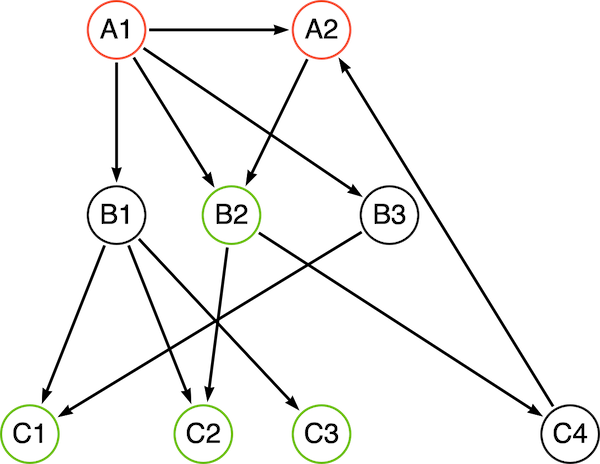
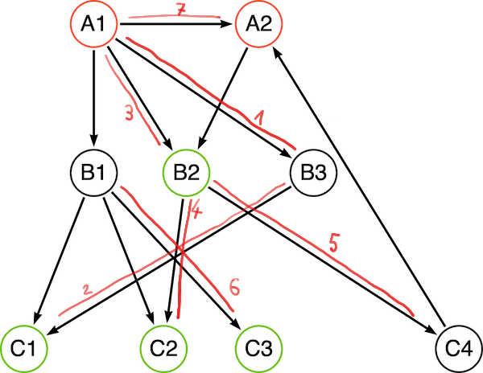

+++
title= "Neo4j Traversal API"
slug= "neo4j-traversal-api"
description = "Introduction to the Neo4j traversal API"
date= 2021-01-05T10:29:26+01:00
lastmod= 2021-01-05T10:29:26+01:00
tags = [ "Neo4j", "Graph-Traversal", "Plugin"]
layout= "post"
type=  "post"
draft= false
[[resources]]
  name = "feature"
  src = "img/header.png"
+++

Neo4j's https://neo4j.com/docs/cypher-refcard/current/[Cypher] is a powerful query language to work with connected data. If the provided functionality is not enough, then there is https://neo4j.com/labs/apoc/[APOC] to fill in the missing bits. I recommend to try and stay with Cypher and APOC as much as possible. Sometimes, https://faboo.org/2021/01/loading-uk-gtfs/[the rules are too complex] to express in Cypher and we need to use the Java API.

The Java API is available to Neo4j plugins, which implies that you package your code in a `.jar` and deploy it inside the `/plugin/` folder of your Neo4j installation. This also means that you need to restart Neo4j to change the plugin.

The https://github.com/neo4j-examples/neo4j-procedure-template[neo4j-procedure-template] is a good starting point as it contains examples and maven pom file that builds a jar file ready for deployment.

Part of the Java API is the https://neo4j.com/docs/java-reference/current/traversal/[Traversal framework] that allows describing the traversal (query) you want to perform and then let the framework handle the actual work.

The framework is single-threaded, simplifies the usage. Given the assumption that in a typical database usage multiple users are performing queries, the single-thread approach should still utilize the power of modern CPUs.

NOTE: There is a big red depreciation warning on the traversal API. While it is true that there are plans to remove the current API, there is no replacement yet and it is save to assume that the API will be available at least for the next major release.

To explain the concepts and components involved, I will be using the following sample graph. While this graph is simple and does warrant the use of a plugin, I hope it will serve to illustrate how to use the API.

[#img-schema, role="img-responsive"]
.sample graph

== Traversal description

The traversal always starts with one or more start nodes, and we can configure how to expand from each node (which relationships to follow). For this, each traversal has one Expander/PathExpander configured, that is called at each node.
The traversal than needs to know which nodes (actually the path leading to that node) should be part of the result set.
The traversal can optionally also take care not to visit nodes/relationships more than ones.

Let's assume that, starting from the red A nodes, we want to collect at least 2 green C nodes. We would first need to construct our traversal configuration (aka TraversalDescription):

[source, java]
----
TraversalDescription traverseDescription = db.beginTx().traversalDescription() <1>
    .uniqueness(NODE_GLOBAL) <2>
    .breadthFirst() <3>
    .expandand(new AllExpander()) <4>
    .evaluationluator(new GreenEvaluator(minimumGreen)) <5>
----

<1> we obtain a traversal description from a transaction, so we can modify it
<2> set the https://neo4j.com/docs/java-reference/current/traversal/#traversal-java-api-uniqueness[uniqueness] to the default value
<3> breadth-first or depth-first, see below
<4> set an Expander that returns relationships to follow for each node
<5> we configure an Evaluator that determines if a path should be collected into the result and if traversal for this *branch* should continue.

After the configuration of the traversal, the traversal can be started by passing one or more start nodes. The returned Traverser object than has methods to access the result.

[source, java]
----
Traverser traverser = traverseDescription.traverse(startNodes);
----

== Expander/PathExpander
For each step (node) in the traversal, we get to decide how to expand, aka, which relationships to follow. For this, the TraversalDescription has exactly one Expander configured. A sample implementation could look like this:
[source, java]
----
public static class AllExpander implements PathExpander<List<String>> {

    @Override
    public Iterable<Relationship> expand(Path path, BranchState<List<String>> branchState) {
              PathLogger.logPath(path, "exp", branchState);
            // expand along all relationships
            // there is a ALLExpander provided, this is here to show the interface
        final ArrayList<String> newState = new ArrayList<>(branchState.getState());
        newState.add((String)path.endNode().getProperty("name"));
        branchState.setState(newState);
        return path.endNode().getRelationships(Direction.OUTGOING);
    }

    @Override
    public PathExpander<List<String>> reverse() {
        return null;
    }
}
----
There is one function `expandand()` that needs to be implemented (there is also `reverse()` that needs to be there, but we can rust return `null` there). The API provides a few implementations of the `PathExpander` interface in `PathExpanders`:

* allTypesAndDirections()
* forType()
* forTypeAndDirection()

so for simple cases (as in the example above), there is no need to implement them.

There is also the option to pass state along using the type parameter of the interface.

== State
The traversal API can move state along. The `BranchState` is accessible from `PathExpanders` as well as from the `PathEvaluator`. Changes to the state are only visible 'downstream'. Usage of that state can greatly simplify the design of your traversal logic.

NOTE: The traversal API has the notion of *Branch*. Whenever the API follows a relationship form a node (A) to a node (B), a new branch is created. The branch for B has the branch A as a parent. State is only passed from parent to child, not the other way around.

You can see how the state changes during the traversal in the tables below.

== Order
The order determines which of the relationships returned from an Expander are traverse next. This is configured by passing an implementation of the `BranchOrderingPolicy` interface to the TraversalDescription via the `order()` call. The API comes with 2 implementations:

=== Depth-First
Expanding and evaluating children of a node first before the siblings of a node. In our example graph, the traversal would look like the following:

[width="80%",frame=none,border=none,stripe=none, cols=",<.<a"]
|====
|  |
Traversal always starts with provided starting nodes, in our case A1 and A2. Before expansion, the node is evaluated and depending on the return value of the `PathEvaluator` the expander will be called.

. A1 is evaluated and expanded. A1 is added to the branch state
. after evaluation of B3, expansion and evaluation of C1. Note that the state has A1 and B3
. B3 has no more children branches, so the next child of A1 is evaluated. The state only has A1 in it, as B3 was added in a child state
. Evaluation of C2
. Evaluation of C4. The state for this and the last step are the same, as the parent is the same
. Evaluation of C3. The state reflects the parents B1 and A1
. Evaluation of A2. There is an expand step (the very last in the table), but since we have evaluated B2 and C4 already and the uniques was set to `NODE_GLOBAL`, no further evaluation is taking place
. evaluation of B1 (I forgot to number it..), it should bo between 6 and 7

|====

[format="csv", cols="^1,^1,<3", separator=":", width="50%", options=header]
|====
Phase : State : Path
evaluation	: [] 	:(A1)
evaluation	: [] 	:(A2)
expand	: [] 	:(A1)
evaluation	: [A1] 	:(A1)-[RELATED]-(B3)
expand	: [A1] 	:(A1)-[RELATED]-(B3)
evaluation	: [A1, B3] 	:(A1)-[RELATED]-(B3)-[RELATED]-(C1)
expand	: [A1, B3] 	:(A1)-[RELATED]-(B3)-[RELATED]-(C1)
evaluation	: [A1] 	:(A1)-[RELATED]-(B2)
expand	: [A1] 	:(A1)-[RELATED]-(B2)
evaluation	: [A1, B2] 	:(A1)-[RELATED]-(B2)-[RELATED]-(C2)
expand	: [A1, B2] 	:(A1)-[RELATED]-(B2)-[RELATED]-(C2)
evaluation	: [A1, B2] 	:(A1)-[RELATED]-(B2)-[RELATED]-(C4)
expand	: [A1, B2] 	:(A1)-[RELATED]-(B2)-[RELATED]-(C4)
evaluation	: [A1] 	:(A1)-[RELATED]-(B1)
expand	: [A1] 	:(A1)-[RELATED]-(B1)
evaluation	: [A1, B1] 	:(A1)-[RELATED]-(B1)-[RELATED]-(C3)
expand	: [A1, B1] 	:(A1)-[RELATED]-(B1)-[RELATED]-(C3)
expand	: [] 	:(A2)
|====

=== Breath-First
Not to be confused with https://xkcd.com/2407/[bread first], this will first go for the siblings of a node before following 'down' to the children:
[format="csv", cols="^1,^1,<3", separator=":", width="50%", options=header]
|====
Phase : State : Path
evaluation	: [] 	:(A1)
evaluation	: [] 	:(A2)
expand	: [] 	:(A1)
expand	: [] 	:(A2)
evaluation	: [A1] 	:(A1)-[RELATED]-(B3)
evaluation	: [A1] 	:(A1)-[RELATED]-(B2)
evaluation	: [A1] 	:(A1)-[RELATED]-(B1)
evaluation	: [A2] 	:(A2)-[RELATED]-(C4)
expand	: [A1] 	:(A1)-[RELATED]-(B3)
evaluation	: [A1, B3] 	:(A1)-[RELATED]-(B3)-[RELATED]-(C1)
expand	: [A1] 	:(A1)-[RELATED]-(B2)
evaluation	: [A1, B2] 	:(A1)-[RELATED]-(B2)-[RELATED]-(C2)
expand	: [A1] 	:(A1)-[RELATED]-(B1)
evaluation	: [A1, B1] 	:(A1)-[RELATED]-(B1)-[RELATED]-(C3)
expand	: [A2] 	:(A2)-[RELATED]-(C4)
expand	: [A1, B3] 	:(A1)-[RELATED]-(B3)-[RELATED]-(C1)
expand	: [A1, B2] 	:(A1)-[RELATED]-(B2)-[RELATED]-(C2)
expand	: [A1, B1] 	:(A1)-[RELATED]-(B1)-[RELATED]-(C3)
|====

I used a list of node names as an example only. You can use the state to pass a calculated weight, costs, counters or complex data structures along.

Complete source code of the example above together with a simple test can be found in the https://github.com/taseroth/gtfs-routing[repository] in the `org.faboo.example.traversal` package.
