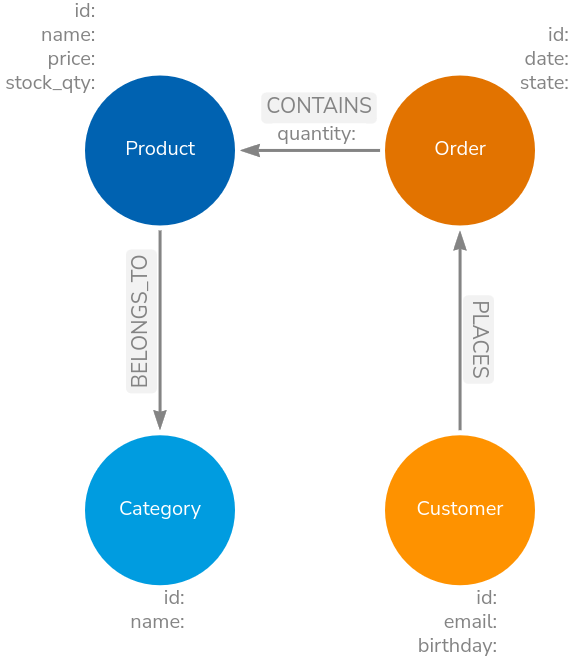
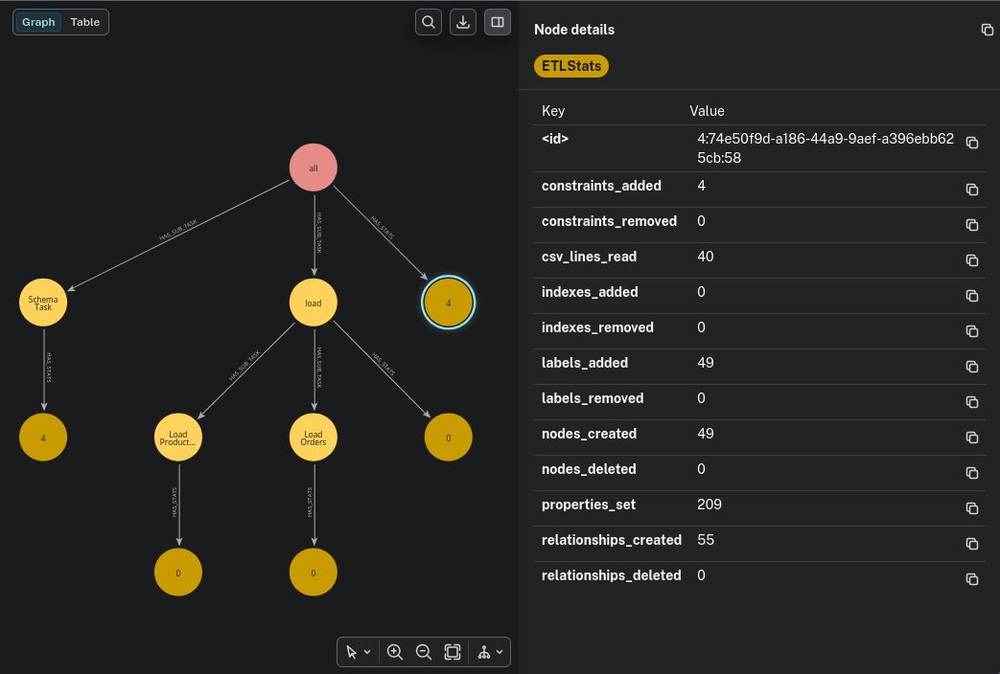

+++
title= "Building an ETL pipeline part 1"
slug= "building-a-pipeline-1"
description = "Building an ETL pipeline part 1"
date= 2026-04-14T13:19:01+01:00
lastmod= 2026-04-15T13:19:01+01:00
tags = [ "ETL", "Python"]
layout= "post"
type=  "post"
draft= false
[comments]
host= "chaos.social"
username= "taseroth"
id=116410350535809160

[[resources]]
  name = "feature"
  src = "img/header.jpg"
+++

In this blog post, we will start building a simple ETL pipeline using the https://neo-technology-field.github.io/python-etl-lib/index.html[Neo4j-ETL-Lib]. The pipeline will load some fictional CSV data. Concepts and ideas will be explained along the way.

== CSV Data
I have chosen a simple domain with just enough detail to explain how to use the etl-lib. You know, the typical e-commerce example: Customers order products.

In our fictional example, we receive the product catalog as `products.csv`:

.products.csv
|===
|product_id |name |sku |price |stock_qty |category_id |category_name
|p-1001 |Wireless Mouse |TECH-MS-001 |29.99 |150 |c-elec |Electronics
|p-1002 |Mechanical Keyboard |TECH-KB-042 |120.00 |50 |c-elec |Electronics
|p-1003 |27" Monitor |TECH-MN-270 |299.99 |30 |c-elec |Electronics
|===

And the customer orders as `orders.csv`:

.orders.csv
|===
|order_id |order_date |order_status |customer_id |email |birthday |product_id |quantity
|ord-5001 |2023-10-01T10:15:00Z |DELIVERED |cust-001 |alice@example.com |1985-04-12 |p-1001 |1
|ord-5001 |2023-10-01T10:15:00Z |DELIVERED |cust-001 |alice@example.com |1985-04-12 |p-1004 |2
|ord-5002 |2023-10-02T14:30:00Z |SHIPPED |cust-002 |bob.jones@email.com |1990-11-20 |p-2003 |1
|===

Not much to it, just the bare minimum to explain some features later.

== Data Model
Our target data model is pictured below:

[#img-schema, role="img-responsive"]
.data model

Again, all very simple. The focus is on how to use the etl-lib and the benefits it hopefully brings.

== Loading the data
A simple LOAD CSV to load the products data would be:

[source]
-----
LOAD CSV WITH HEADERS FROM 'file:///products.csv' AS row
MERGE (c:Category {id: row.category_id})
SET c.name = row.category_name
MERGE (p:Product {id: row.product_id})
SET p.name = row.name,
    p.price = toFloat(row.price),
    p.stock_qty = toInteger(row.stock_qty)
MERGE (p)-[:BELONGS_TO]->(c)
-----

While this is fine and can be extended with batching, it is hard to run autonomously, trace executions, handle failures, and so on.

To load the same data with the library, we need to wrap that inside a class derived from `Task`.

The etl-lib provides multiple such classes to load data from various data sources. One such class is `CSVLoad2Neo4jTask`. The code below uses that class to load exactly the same data:

[source, Python]
----
class LoadProducts(CSVLoad2Neo4jTask):

    def __init__(self, context: ETLContext, file: Path):
        super().__init__(context=context, file=file) <1>

    def _query(self) -> str | list[str]:
        return """
        UNWIND $batch as row <2>
        MERGE (c:Category {id: row.category_id})
        SET c.name = row.category_name
        MERGE (p:Product {id: row.product_id})
        SET p.name = row.name,
            p.price = toFloat(row.price),
            p.stock_qty = toInteger(row.stock_qty)
        MERGE (p)-[:BELONGS_TO]->(c)
        """
----
<1> Pass in the context and file path
<2> The etl-lib works with batches for improved performance, hence we need to `UNWIND` the batches in the first line. The batch size defaults to 5000 but can be configured via an init param.

== Building the pipeline
The above `LoadProducts` class can not run on its own; it needs to be part of a pipeline and have access to an `ETLContext` instance, which provides access to databases, logging and so on:

[source, Python]
----
@cli.command("import") <1>
@click.argument('input_directory', type=click.Path(exists=True, file_okay=False, dir_okay=True, path_type=Path))
@click.pass_context <2>
def main(ctx, input_directory):

    # Set up logging
    log_file = ctx.obj["log_file"]
    setup_logging(log_file)
    logging.info(f"Processing directory: {input_directory}")

    # Log and display settings
    neo4j_uri = ctx.obj["neo4j_uri"]
    neo4j_user = ctx.obj["neo4j_user"]
    database_name = ctx.obj["database_name"]
    logging.info(f"Neo4j URL: {neo4j_uri}")
    logging.info(f"Neo4j User: {neo4j_user}")
    logging.info(f"Neo4j Database Name: {database_name}")

    if log_file:
        logging.info(f"Log File: {log_file}")

    context = ETLContext(env_vars=dict(os.environ)) <3>

    logging.info(f"Connecting to Neo4j at {neo4j_uri} with user {neo4j_user} to access database {database_name}...")

    load_prods = LoadProducts(context=context, file=input_directory / "products.csv") <4>

    load_group = TaskGroup(context=context, tasks=[load_prods], name="main") <5>
    context.reporter.register_tasks(load_group) <6>
    load_group.execute() <7>
----
<1> 'Inherit' common command line options provided by the etl-lib
<2> Needed to have access to the above commands
<3> Create a context from the parameters provided via the command line or environment parameters. The context is used to pass access to infrastructure objects such as databases and logging.
<4> Instantiate our loading class
<5> Optionally group multiple Tasks together
<6> Register the task tree with the reporter, so that statistics can be gathered and reported.
<7> Start the pipeline

The full sample code for this demo can be found at https://codeberg.org/taseroth/etl-pipeline. Look at the tag `v1..` as this represents the version used in this blog post.

We need to pass the connection details to that Python code. This can be done via CLI parameters or by adding the following to `.env`:
[source, bash]
----
NEO4J_URI=neo4j://localhost:7687
NEO4J_USERNAME=neo4j
NEO4J_PASSWORD=<super secret>
NEO4J_DATABASE=neo4j
LOG_FILE=import.log
----

So, what do we gain with all that code?

* As mentioned above: batching, even if that is not needed for our sample dataset. Rows from the data source are batched transparently and passed through the processors. Right now, with that simple pipeline, this might not be needed, but for real data it will be.
* Reporting. Right now, it only reports to the configured logfile. We will enable reporting to a database in the next example.

Starting the pipeline with `python pipeline.py import data/small` would produce the following log:
[source, bash]
----
2026-04-15 16:52:43,841 - INFO - root - [MainThread] - Processing directory: data/small
2026-04-15 16:52:43,841 - INFO - root - [MainThread] - Neo4j URL: neo4j://localhost:7687
2026-04-15 16:52:43,841 - INFO - root - [MainThread] - Neo4j User: neo4j
2026-04-15 16:52:43,841 - INFO - root - [MainThread] - Neo4j Database Name: neo4j
2026-04-15 16:52:43,841 - INFO - root - [MainThread] - Log File: import.log
2026-04-15 16:52:43,852 - INFO - etl_lib.core.ETLContext.Neo4jContext - [MainThread] - driver connected to instance at neo4j://localhost:7687 with username neo4j and database neo4j
2026-04-15 16:52:43,852 - INFO - root - [MainThread] - Connecting to Neo4j at neo4j://localhost:7687 with user neo4j to access database neo4j...
2026-04-15 16:52:43,852 - INFO - etl_lib.core.ProgressReporter.ProgressReporter - [MainThread] -
└──main
   └──LoadProducts

2026-04-15 16:52:43,852 - INFO - etl_lib.core.ProgressReporter.ProgressReporter - [MainThread] - starting main
2026-04-15 16:52:43,853 - INFO - etl_lib.core.ProgressReporter.ProgressReporter - [MainThread] - starting LoadProducts
2026-04-15 16:52:44,138 - INFO - etl_lib.core.ProgressReporter.ProgressReporter - [MainThread] - finished LoadProducts in 0:00:00.285090 with status: success
+----------------+-----------------+------------------+------------------+-------------------------+
|   labels_added |   nodes_created |   csv_lines_read |   properties_set |   relationships_created |
|----------------+-----------------+------------------+------------------+-------------------------|
|             23 |              23 |               20 |              103 |                      20 |
+----------------+-----------------+------------------+------------------+-------------------------+
2026-04-15 16:52:44,138 - INFO - etl_lib.core.ProgressReporter.ProgressReporter - [MainThread] - finished main in 0:00:00.285677 with status: success
+----------------+-----------------+------------------+------------------+-------------------------+
|   labels_added |   nodes_created |   csv_lines_read |   properties_set |   relationships_created |
|----------------+-----------------+------------------+------------------+-------------------------|
|             23 |              23 |               20 |              103 |                      20 |
+----------------+-----------------+------------------+------------------+-------------------------+
----

Let's add some more Tasks to the pipeline:

In the below snippet, I added 2 Tasks:

* `LoadOrders` is very similar to `LoadProducts` but for loading the `orders.csv`
* `SchemaTask` is a thin wrapper around some `CREATE CONSTRAINT IF NOT EXISTS FOR` statements, ensuring we have constraints and indexes in place. It is idempotent, so we can run it each time with the pipeline.

[source, Python]
----
    load_prods = LoadProducts(context=context, file=input_directory / "products.csv")
    load_orders = LoadOrders(context=context, file=input_directory / "orders.csv")

    load_group = TaskGroup(context=context, tasks=[load_prods, load_orders], name="load")
    schema = SchemaTask(context=context)
    all_group = TaskGroup(context=context, tasks=[schema,load_group], name="all")
    context.reporter.register_tasks(all_group)
    all_group.execute()
----

The output becomes a bit more interesting now:
[source, bash]
----
2026-04-15 19:26:25,338 - INFO - root - [MainThread] - Processing directory: data/small
2026-04-15 19:26:25,338 - INFO - root - [MainThread] - Neo4j URL: neo4j://localhost:7687
2026-04-15 19:26:25,338 - INFO - root - [MainThread] - Neo4j User: neo4j
2026-04-15 19:26:25,338 - INFO - root - [MainThread] - Neo4j Database Name: neo4j
2026-04-15 19:26:25,338 - INFO - root - [MainThread] - Log File: import.log
2026-04-15 19:26:25,347 - INFO - etl_lib.core.ETLContext.Neo4jContext - [MainThread] - driver connected to instance at neo4j://localhost:7687 with username neo4j and database neo4j
2026-04-15 19:26:25,347 - INFO - root - [MainThread] - Connecting to Neo4j at neo4j://localhost:7687 with user neo4j to access database neo4j...
2026-04-15 19:26:25,347 - INFO - etl_lib.core.ProgressReporter.ProgressReporter - [MainThread] -
└──all
   ├──SchemaTask
   └──load
      ├──LoadProducts
      └──LoadOrders

2026-04-15 19:26:25,348 - INFO - etl_lib.core.ProgressReporter.ProgressReporter - [MainThread] - starting all
2026-04-15 19:26:25,348 - INFO - etl_lib.core.ProgressReporter.ProgressReporter - [MainThread] - starting SchemaTask
2026-04-15 19:26:25,436 - INFO - etl_lib.core.ProgressReporter.ProgressReporter - [MainThread] - finished SchemaTask in 0:00:00.088133 with status: success
+---------------------+
|   constraints_added |
|---------------------|
|                   4 |
+---------------------+
2026-04-15 19:26:25,436 - INFO - etl_lib.core.ProgressReporter.ProgressReporter - [MainThread] - starting load
2026-04-15 19:26:25,436 - INFO - etl_lib.core.ProgressReporter.ProgressReporter - [MainThread] - starting LoadProducts
2026-04-15 19:26:25,500 - INFO - etl_lib.core.ProgressReporter.ProgressReporter - [MainThread] - finished LoadProducts in 0:00:00.063697 with status: success
+------------------+----------------+------------------+-------------------------+-----------------+
|   csv_lines_read |   labels_added |   properties_set |   relationships_created |   nodes_created |
|------------------+----------------+------------------+-------------------------+-----------------|
|               20 |             23 |              103 |                      20 |              23 |
+------------------+----------------+------------------+-------------------------+-----------------+
2026-04-15 19:26:25,500 - INFO - etl_lib.core.ProgressReporter.ProgressReporter - [MainThread] - starting LoadOrders
2026-04-15 19:26:25,594 - INFO - etl_lib.core.ProgressReporter.ProgressReporter - [MainThread] - finished LoadOrders in 0:00:00.093259 with status: success
+------------------+----------------+------------------+-------------------------+-----------------+
|   csv_lines_read |   labels_added |   properties_set |   relationships_created |   nodes_created |
|------------------+----------------+------------------+-------------------------+-----------------|
|               20 |             26 |              106 |                      35 |              26 |
+------------------+----------------+------------------+-------------------------+-----------------+
2026-04-15 19:26:25,594 - INFO - etl_lib.core.ProgressReporter.ProgressReporter - [MainThread] - finished load in 0:00:00.157716 with status: success
+------------------+----------------+------------------+-------------------------+-----------------+
|   csv_lines_read |   labels_added |   properties_set |   relationships_created |   nodes_created |
|------------------+----------------+------------------+-------------------------+-----------------|
|               40 |             49 |              209 |                      55 |              49 |
+------------------+----------------+------------------+-------------------------+-----------------+
2026-04-15 19:26:25,594 - INFO - etl_lib.core.ProgressReporter.ProgressReporter - [MainThread] - finished all in 0:00:00.246581 with status: success
+-------------------------+-----------------+---------------------+------------------+----------------+------------------+
|   relationships_created |   nodes_created |   constraints_added |   properties_set |   labels_added |   csv_lines_read |
|-------------------------+-----------------+---------------------+------------------+----------------+------------------|
|                      55 |              49 |                   4 |              209 |             49 |               40 |
+-------------------------+-----------------+---------------------+------------------+----------------+------------------+
----

As you can see, the `Task`s form a tree. Each `Task` and `TaskGroup` reports some statistics, with the last one reporting the overall statistics for the pipeline.
Running the same pipeline again with the same data (and an already filled database), we can see that the stats report very different numbers:
[source, bash]
----
+------------------+------------------+
|   properties_set |   csv_lines_read |
|------------------+------------------|
|              160 |               40 |
+------------------+------------------+
----

That is already quite helpful.

== Reporting to a database
By simply setting `REPORTER_DATABASE=neo4j` in the environment (`.env` file), the reporter will write these statistics to a database. The database pointed to could be separate from the database we load the data into.
The log will report which database it is using:

`INFO - etl_lib.core.ProgressReporter.Neo4jProgressReporter - [MainThread] - progress reporting to database: neo4j`

Running
[source, Cypher]
----
MATCH p=(:ETLRun)-->*()
RETURN p
----

We will see something like
[#img-run-stats, role="img-responsive"]
.Run Statistics

This graph is updated with each batch processed. So, having long-running pipelines, you can see the progress. The etl-lib also provides a Neo4j dashboard that provides an overview and details on ETL runs. The imported `@cli` also added CLI commands to query and manage statistics:
[source, bash]
----
python pipeline.py
Usage: pipeline.py [OPTIONS] COMMAND [ARGS]...

  Command-line tool for ETL pipelines.

  Environment variables can be configured via a .env file or overridden via
  CLI options:

  - NEO4J_URI: Neo4j database URI
  - NEO4J_USERNAME: Neo4j username
  - NEO4J_PASSWORD: Neo4j password
  - LOG_FILE: Path to the log file
  - DATABASE_NAME: Neo4j database name (default: neo4j)

Options:
  --neo4j-uri TEXT       Neo4j database URI
  --neo4j-user TEXT      Neo4j username
  --neo4j-password TEXT  Neo4j password
  --log-file TEXT        Path to the log file
  --database-name TEXT   Neo4j database name (default: neo4j)
  --help                 Show this message and exit.

Commands:
  delete  Delete runs based on run ID, date, or age.
  detail  Show a breakdown of the task for the specified run, including...
  import
  query   Retrieve the list of the last x ETL runs from the database and...
----
For more information use the `--help` on the cli.

In the next part, we will look at more advanced features of the Neo4j-ETL-Lib.

